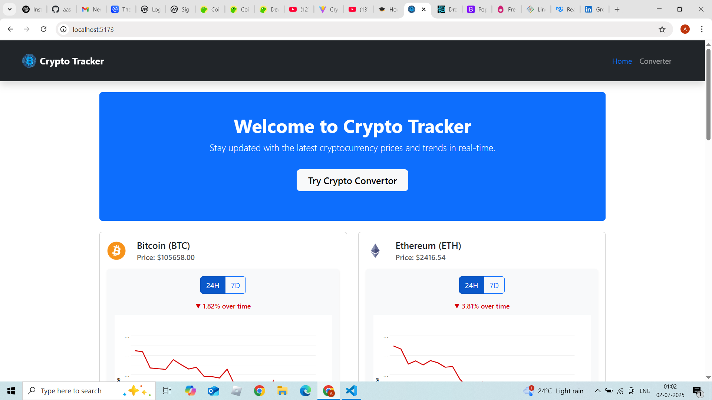
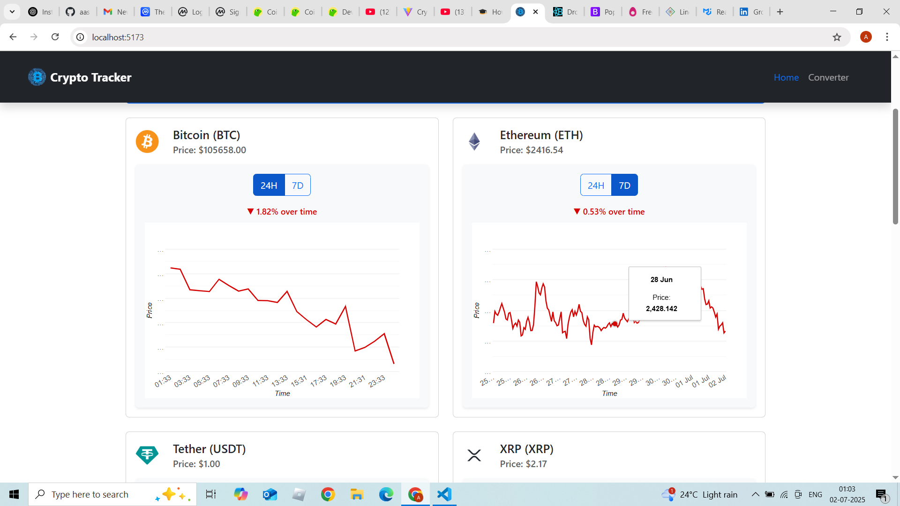
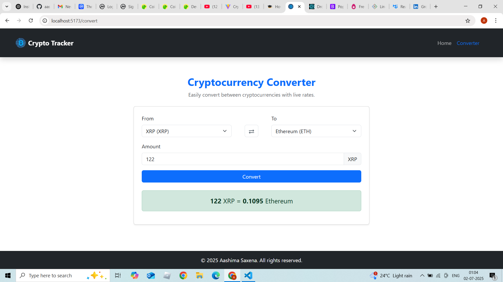

# Crypto Tracker 🚀

A modern, mobile-first cryptocurrency tracking web application built using React, Redux, and React-Bootstrap. It displays real-time prices, price changes, and a converter to switch between cryptocurrencies.

---

## 📸 Screenshots

- Homepage with live coin prices, trends (24h/7d), and charts.
  
  

- CryptoConverter with smooth animations and real-time conversion logic.
  

---

## 🛠️ Tech Stack

- **Frontend**: React + TypeScript
- **State Management**: Redux Toolkit
- **Styling**: React-Bootstrap + CSS Modules
- **Animation**: Framer Motion
- **API**: [CoinGecko](https://www.coingecko.com/) Public API
- **Chart**: [MUI X Charts](https://mui.com/x/react-charts/lines/)

---

## ⚙️ Features

### Homepage

- Displays top coins by market cap
- Current price
- 24h and 7d change with color coding
- Line charts for price trends

### Converter

- Convert between two crypto coins
- Swap animation included
- Handles API errors and server failures gracefully

---

## 🏗️ Architecture & Reasoning

- **React SPA**: Fast, modular, and great for SEO with SSR or static export.
- **Redux Toolkit**: Simplified and scalable state management.
- **CoinGecko API**: Reliable public API with no auth barriers for initial version.
- **Responsive Design**: Bootstrap grid and components ensure mobile-first UI.

---

## 📄 License

This project is open-source. API usage must comply with CoinGecko’s public API terms.
